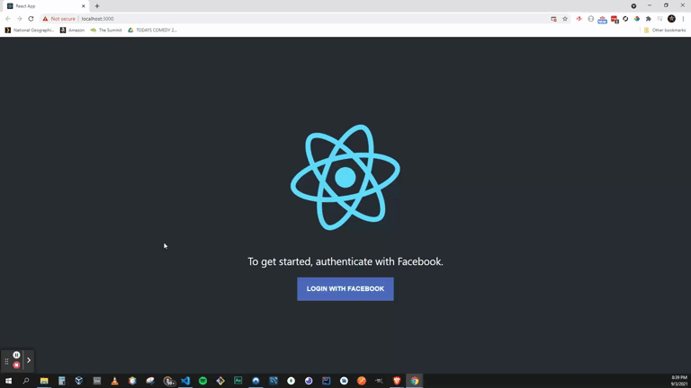

# REACT - Facebook Login Button

### About

In this project we create a Facebook login button in react to get the user's name, email and picture. We'll then add it to the component state and render the data.

